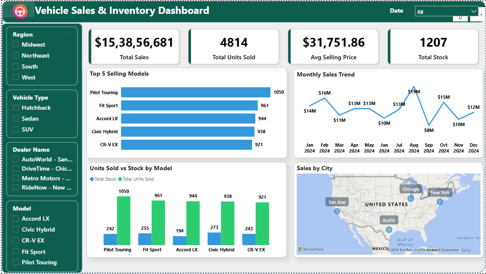

# 🚗 Vehicle Sales & Inventory Dashboard 📊

This Power BI dashboard helps automotive sales and inventory teams track sales performance, monitor stock levels, and analyze top-selling vehicle models across regions and dealerships.

---

## 📌 Project Overview

The **Vehicle Sales & Inventory Dashboard** consolidates sales and inventory metrics to enable data-driven decision-making. Designed for use by automotive business analysts, inventory managers, and sales strategists, the dashboard highlights key KPIs, monthly trends, and stock-to-sales alignment.

---

## 📁 About the Dataset

The dataset includes:
- Vehicle sales transactions
- Inventory levels by model and dealer
- Vehicle model types, regions, and sale dates

It supports both temporal and geographic analysis of vehicle performance.

---

## 🛠 Data Preparation

Data cleaning and transformation were done using **Power Query**, including:
- Creating a calendar table for trend analysis
- Deriving calculated columns and DAX measures

---

## 🧱 Data Modeling

A **star schema** was implemented with:
- 2 Fact Tables: `SalesData`, `InventoryData`
- 3 Dimension Tables: `Dealers`, `Calendar`, and a **bridging table `DimModel`**

### 🔁 Bridging Logic:
To resolve many-to-many issues between Sales and Inventory data:
- A `DimModel` table was created using a `DISTINCT UNION` of model names
- One-to-many relationships were defined:
  - `DimModel[Model] → SalesData[Model]`
  - `DimModel[Model] → InventoryData[Model]`
- All model-level filters reference `DimModel[Model]` for consistency

---

## 📊 Dashboard Visuals

- **KPI Cards:**  
  - Total Sales: `$15.38M`  
  - Units Sold: `4,814`  
  - Avg. Selling Price: `$31,751.86`  
  - Total Stock: `1,207`

- **Top 5 Selling Models:**  
  Pilot Touring, Fit Sport, Accord LX, Civic Hybrid, CR-V EX

- **Monthly Sales Trend:**  
  Sales peaked in **March 2024** at `$19M`; lowest in April

- **Units Sold vs Stock by Model:**  
  Bar chart comparing inventory vs demand

- **Geo Map:**  
  Sales across Chicago, Austin, New York, and San Jose

- **Slicers:**  
  Region, Dealer, Vehicle Type, Model, Date

---

## 📸 Dashboard Screenshot

---

## 📈 Key Insights

- March 2024 had the highest sales, April the lowest
- Inventory is well-aligned with high-performing models
- Midwest and South regions show strong sales volume
- CR-V EX underperforms in both sales and stock movement

---

## ✅ Recommendations

- Maintain stock for high-volume models (Pilot Touring, Fit Sport)
- Investigate CR-V EX performance for potential improvement
- Use monthly trends to plan marketing promotions
- Balance stock distribution across regions

---

## 🧰 Tools Used

- Power BI Desktop  
- Power Query (M)  
- DAX for calculated columns and KPIs  
- Excel (for data shaping)

---